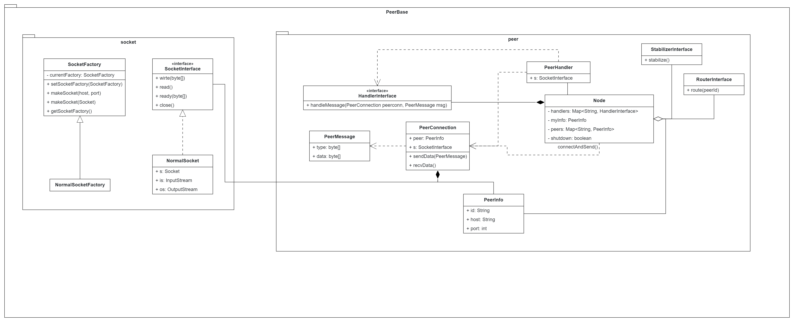

# N2N
Node to Node, a lightweight P2P framework.
> Edited design of [PeerBase](https://github.com/nadeemabdulhamid/PeerBase) by Nadeem Abdul Hamid.

# Features
- Using TCP
- Unstructured P2P network

# Protocol design
| name        | size (byte)   | description  |
|-------------|---------------|--------------|
| type        | 4             | message type |
| data_length | 4             | data length  |
| data        | {data_length} | data payload |

# API design

[//]: # (# TODO)
[//]: # (- license)
[//]: # (- javadoc)
[//]: # (- logger)
